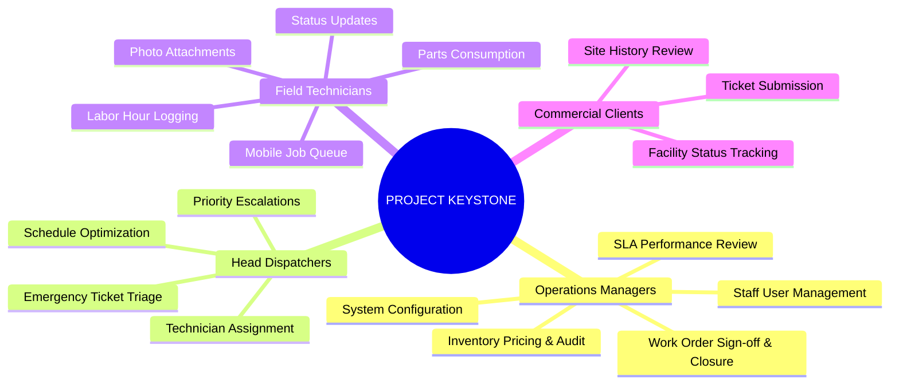
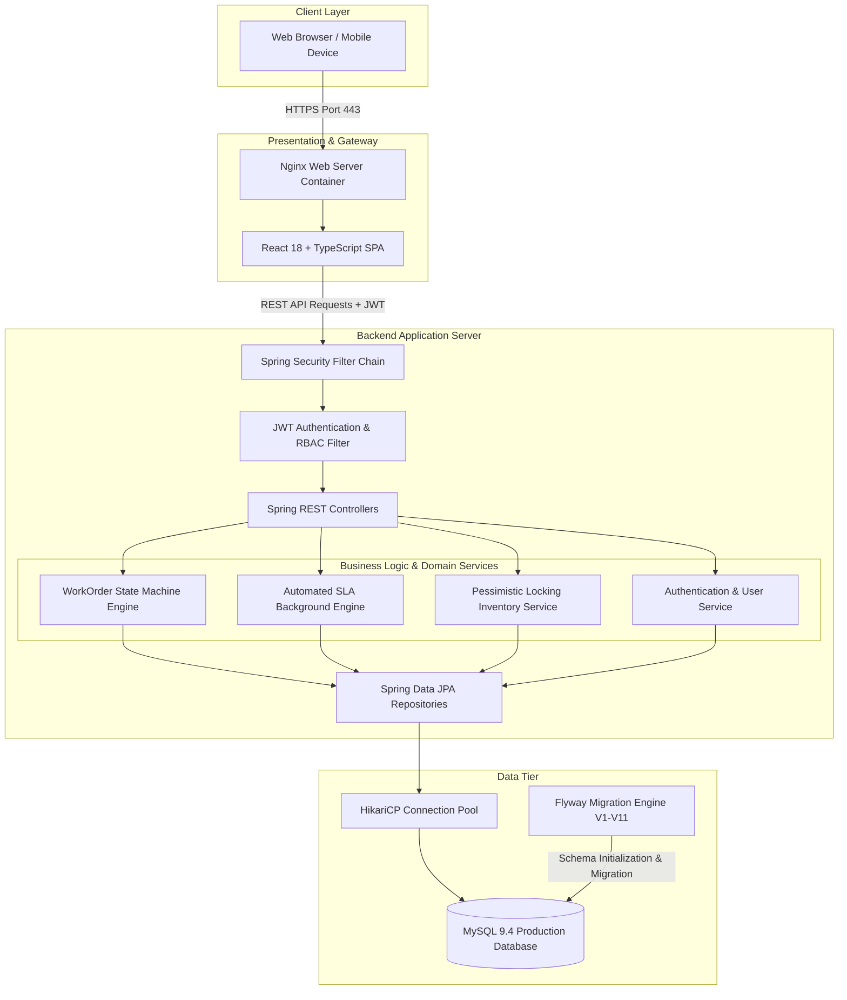
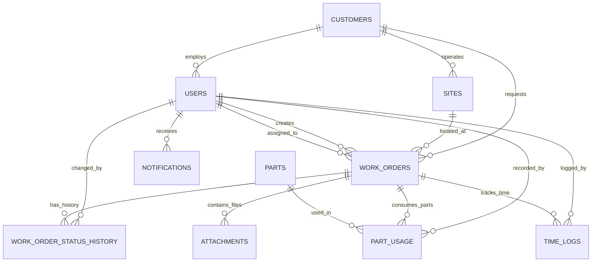
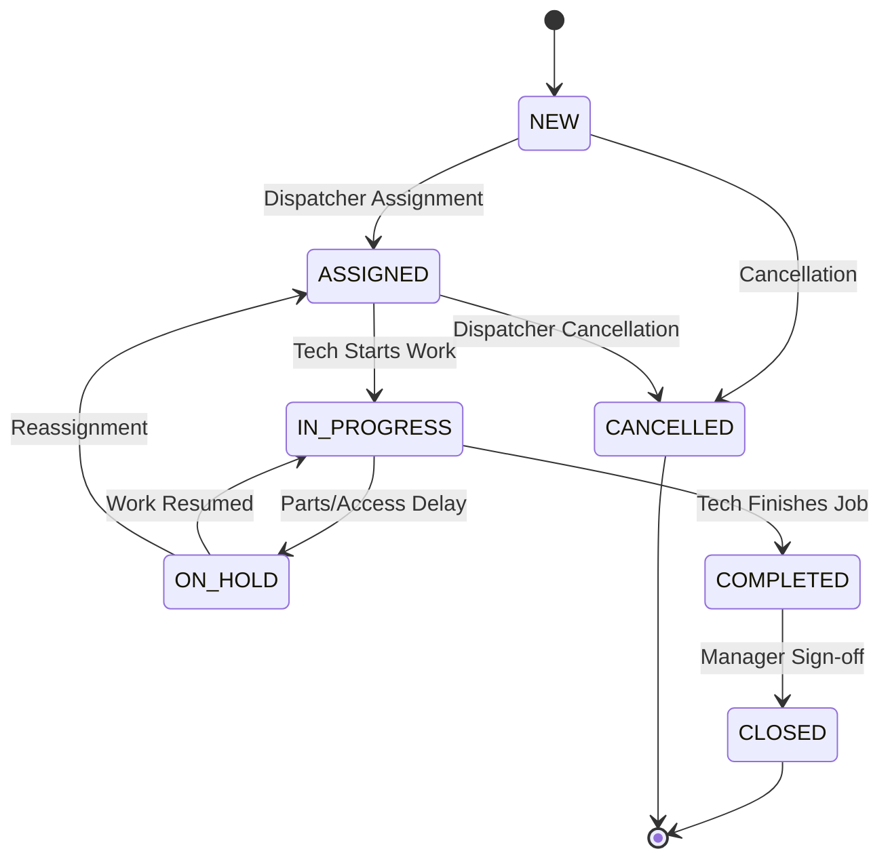
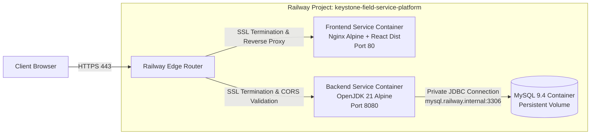

# PROJECT REPORT

---

# PROJECT KEYSTONE
## Enterprise Field Service Management (FSM) Platform for Commercial Facilities Maintenance

---

### **A Technical and Architectural Project Report**
**Submitted for Technical Evaluation and Academic Review**

- **Project Title:** PROJECT KEYSTONE — Field Service Management Platform
- **Domain:** Enterprise Web Systems / Distributed Cloud Applications / Facility Management Automation
- **Core Technology Stack:** React 18, TypeScript, Spring Boot 3.3.4, Java 21 LTS, MySQL 9.4, Flyway, Docker, Railway Cloud
- **Repository:** [https://github.com/ashutosh7034/keystone-field-service-platform](https://github.com/ashutosh7034/keystone-field-service-platform)
- **Live Production URL (Frontend):** [https://frontend-production-7397.up.railway.app](https://frontend-production-7397.up.railway.app)
- **Live Production URL (Backend):** [https://backend-production-e385.up.railway.app](https://backend-production-e385.up.railway.app)

---

## 1. Abstract

Modern commercial facilities management requires rigorous, real-time coordination between facility directors, centralized dispatchers, field technicians, and enterprise clients. Traditional facilities operations frequently struggle with uncoordinated scheduling, lack of transactional concurrency control during parts consumption, untracked SLA breaches, and data security risks in multi-tenant environments.

**PROJECT KEYSTONE** is a distributed, full-stack enterprise Field Service Management (FSM) platform engineered to address these operational challenges. Built on **Java 21 LTS**, **Spring Boot 3.3.4**, and **React 18 with TypeScript**, KEYSTONE introduces a mathematically deterministic **Work Order Finite State Machine**, **pessimistic warehouse inventory locking (`PESSIMISTIC_WRITE`)**, an automated **background SLA calculation heartbeat**, and **strict multi-tenant client isolation**. Version-controlled through **Flyway 10** across 11 database schema migrations on **MySQL 9.4** and deployed via **Docker containers on Railway Cloud**, the platform delivers an auditable, high-throughput, and responsive facility maintenance ecosystem.

---

## 2. Introduction

Field Service Management encompasses the coordination of an organization’s field personnel, physical assets, spare parts inventory, and emergency work requests. Commercial property maintenance spans mission-critical trades including HVAC (Heating, Ventilation, and Air Conditioning), high-voltage electrical distribution, and commercial plumbing. 

In high-stakes commercial environments (such as commercial office towers, retail shopping malls, and high-density data centers), equipment failure can result in substantial financial penalties and operational downtime. **PROJECT KEYSTONE** provides an integrated software platform that digitizes the entire lifecycle of maintenance requests, from client ticket creation to dispatcher triage, technician field execution, inventory deduction, and managerial closure.

---

## 3. Background & Existing Problem

### 3.1 Background
Traditional facilities management relies on fragmented communication channels such as unstructured emails, phone hotlines, and manual spreadsheets. As organizations scale across multiple properties and dozens of technicians, manual processes fail to maintain data integrity and regulatory compliance.

### 3.2 Identified Shortcomings in Existing Systems
1. **Uncontrolled Lifecycle Skips:** Field personnel often mark jobs completed without recording required diagnostic findings, time logs, or replaced parts.
2. **Warehouse Inventory Race Conditions:** Multiple technicians simultaneously consuming parts from warehouse stock without transactional locking lead to negative inventory counts and phantom stock.
3. **Reactive SLA Tracking:** Contractual response and resolution deadlines are reviewed post-mortem rather than monitored in real-time, resulting in costly SLA penalty breaches.
4. **Tenant Data Leakage:** Lack of row-level customer isolation allows commercial tenants to view confidential maintenance records of other clients.
5. **Lack of Immutable Audit Trails:** When dispute arises regarding job delays, traditional logs fail to record who initiated a status change, when it occurred, and why.

---

## 4. Problem Statement

> *"To design, implement, test, and deploy a robust, secure, and multi-tenant enterprise Field Service Management platform that enforces deterministic lifecycle state transitions, guarantees atomic inventory transactions under concurrent access, provides real-time proactive SLA monitoring, and delivers tailored role-based user experiences across desktop and mobile devices."*

---

## 5. Objectives

1. **Deterministic Lifecycle Governance:** Implement a strict backend state machine that enforces allowed transitions (`NEW` ➔ `ASSIGNED` ➔ `IN_PROGRESS` ➔ `ON_HOLD` / `COMPLETED` ➔ `CLOSED` / `CANCELLED`) and rejects illegal requests with `409 Conflict`.
2. **Atomic Inventory Concurrency Control:** Prevent warehouse stock inconsistencies during simultaneous technician checkouts using database-level pessimistic locking.
3. **Automated Background SLA Heartbeat:** Implement an automated scheduled engine (`@Scheduled`) to continuously recalculate SLA compliance (`ON_TRACK`, `AT_RISK`, `BREACHED`) based on priority matrices.
4. **Multi-Tenant Client Security:** Ensure strict customer isolation so that enterprise tenants only access their own sites and service tickets.
5. **Modern, Responsive User Experience:** Deliver an intuitive single-page application (SPA) with dedicated interfaces for Managers, Dispatchers, Technicians, and Clients.
6. **Cloud-Native Deployment:** Containerize the full stack with Docker and deploy to production on Railway with automated health verification.

---

## 6. Scope of the Project

### In-Scope
- User authentication and stateless JWT issuance with HMAC-SHA384 signatures.
- Role-Based Access Control (RBAC) across four distinct roles: Manager, Dispatcher, Technician, Customer.
- Customer management, site facility mapping, and asset location tracking.
- Warehouse spare parts inventory management with unit costs, lead times, and low-stock alerts.
- Work order creation, dispatch assignment, status progression, and managerial closure.
- Labor hours tracking, work logs, and technician timesheets.
- Multipart document and photo attachment management for field work orders.
- Comprehensive RESTful API with automated OpenAPI / Swagger documentation.
- Automated database schema migrations and seed reference data.

### Out-of-Scope (Future Enhancements)
- Native mobile applications (iOS / Android) — mobile web viewport is implemented.
- Payment gateway integration for client billing.
- Geolocation tracking and automated GPS routing algorithms.

---

## 7. Target Users & Stakeholders



---

## 8. System Architecture

PROJECT KEYSTONE adopts a layered, decoupled client-server architecture. The frontend Single-Page Application (SPA) communicates with the Spring Boot backend exclusively via stateless RESTful JSON APIs secured by JWT Bearer tokens.



---

## 9. Technology Stack

### 9.1 Backend Technologies
| Component | Technology / Library | Version | Justification |
| :--- | :--- | :--- | :--- |
| **Language** | Java Development Kit (JDK) | 21 LTS | Modern language features (Records, Pattern Matching, Virtual Threads readiness). |
| **Framework** | Spring Boot | 3.3.4 | Industry-standard enterprise application framework. |
| **Security** | Spring Security | 6.3.3 | Robust declarative security, method-level authorization, stateless filter chain. |
| **JWT Library** | Java JWT (`jjwt-api`, `jjwt-impl`) | 0.12.6 | RFC 7519 compliant JSON Web Token creation and verification. |
| **ORM / JPA** | Hibernate ORM / Spring Data JPA | 6.5.3 | High-performance object-relational mapping, transaction management. |
| **Database Migrations** | Flyway Core & Flyway MySQL | 10.x | Reproducible, version-controlled database schema evolution. |
| **API Documentation** | SpringDoc OpenAPI | 2.6.0 | Automated OpenAPI 3.0 specification and interactive Swagger UI. |
| **Build Tool** | Apache Maven Wrapper | 3.9.6 | Standardized dependency management and multi-stage Docker build support. |

### 9.2 Frontend Technologies
| Component | Technology / Library | Version | Justification |
| :--- | :--- | :--- | :--- |
| **Library** | React | 18.3.1 | Declarative component hierarchy and responsive UI rendering. |
| **Language** | TypeScript | 5.6.2 | Compile-time static type checking, eliminating runtime type errors. |
| **Bundler / Server** | Vite | 5.4.8 | Ultra-fast Hot Module Replacement (HMR) and optimized rollup production bundles. |
| **HTTP Client** | Axios | 1.7.7 | Promise-based HTTP client with centralized request/response interceptors. |
| **Icons** | Lucide React | 0.447.0 | Clean, modern, tree-shakeable SVG iconography. |
| **Styling** | Vanilla CSS Design System | Custom | Full control over design tokens, glassmorphism, responsive breakpoints. |

### 9.3 Database & Infrastructure
| Component | Technology | Version / Provider | Configuration |
| :--- | :--- | :--- | :--- |
| **Database Engine** | MySQL | 9.4 | InnoDB engine, UTF-8 MB4, foreign keys, B-tree indexes. |
| **Hosting Platform** | Railway Cloud | Enterprise PaaS | Containerized micro-architecture with private internal networking. |
| **Frontend Container** | Nginx Alpine | 1.27-alpine | High-performance static web server with dynamic `$PORT` template substitution. |
| **Backend Container** | Temurin JRE Alpine | 21-jre-alpine | Lightweight, hardened Java runtime container. |

---

## 10. Database Design & Entity Relationships

The relational database schema is structured around 10 relational tables managed across 11 Flyway migrations.



### 10.1 Schema Entity Catalog

1. **`users`**: Stores system operators, technicians, and customer representatives.
2. **`customers`**: Commercial client enterprises (e.g., Apex Commercial Towers, Metro Retail Outlets).
3. **`sites`**: Physical locations and buildings owned by customer organizations.
4. **`parts`**: Spare parts warehouse catalog with stock quantities, unit costs, and reorder lead times.
5. **`work_orders`**: Central operational entity storing status, priority, customer, site, technician, and SLA deadlines.
6. **`work_order_status_history`**: Append-only immutable log tracking every status transition with actor and notes.
7. **`part_usage`**: Line items of warehouse inventory consumed against specific work orders.
8. **`time_logs`**: Labor hours and duration logs submitted by technicians.
9. **`notifications`**: System alerts generated on assignment, status change, or SLA warnings.
10. **`attachments`**: Metadata and storage references for uploaded photos and diagnostic documents.

---

## 11. Security Design & Authorization (RBAC)

### 11.1 Stateless JWT Architecture
Authentication is entirely stateless. Upon successful authentication at `/api/auth/login`, the server returns a cryptographically signed JSON Web Token using the HMAC-SHA384 algorithm:

```json
{
  "sub": "manager@keystone.demo",
  "role": "ROLE_MANAGER",
  "fullName": "Eleanor Vance (Operations Director)",
  "userId": 1,
  "customerId": null,
  "iat": 1789848043,
  "exp": 1789934443
}
```

### 11.2 Role-Based Access Matrix

| Feature / Resource Endpoint | Manager | Dispatcher | Technician | Customer |
| :--- | :---: | :---: | :---: | :---: |
| **View Operations Dashboard** | Yes | Yes | No (Portal View) | No (Client View) |
| **Search All Work Orders** | Yes | Yes | Assigned Only | Tenant Only |
| **Create Work Orders** | Yes | Yes | No | Yes (Request) |
| **Assign / Reassign Technician** | Yes | Yes | No | No |
| **Transition: Accept / In Progress** | Yes | No | Yes (Assigned) | No |
| **Transition: Hold / Resume** | Yes | Yes | Yes (Assigned) | No |
| **Transition: Complete Work** | Yes | No | Yes (Assigned) | No |
| **Approve & Close Work Order** | Yes | No | No | No |
| **Log Labor Time** | Yes | No | Yes (Assigned) | No |
| **Consume Warehouse Parts** | Yes | No | Yes (Assigned) | No |
| **Manage Customers & Sites** | Yes | View Only | View Only | View Own |
| **Manage Parts Catalog & Pricing**| Yes | View Only | View Only | No |
| **Manage Users & Permissions** | Yes | No | No | No |

---

## 12. Core Business Logic Engines

### 12.1 Work Order Finite State Machine
The state machine guarantees that no work order can bypass required operational milestones:



### 12.2 Pessimistic Inventory Locking Algorithm
To prevent inventory overdrawing during high-concurrency operations, the platform utilizes database-level pessimistic locking in `PartUsageService.java`:

```java
@Transactional
public PartUsageResponse logPartUsage(Long workOrderId, PartUsageRequest request, User user) {
    // Acquire exclusive row-level write lock on the part record
    Part part = partRepository.findByIdWithPessimisticLock(request.getPartId())
        .orElseThrow(() -> new ResourceNotFoundException("Part not found"));

    if (part.getStockQuantity() < request.getQuantity()) {
        throw new InsufficientStockException(
            "Insufficient inventory for part [" + part.getName() + "]. Available: " 
            + part.getStockQuantity() + ", Requested: " + request.getQuantity()
        );
    }

    // Deduct stock atomically
    part.setStockQuantity(part.getStockQuantity() - request.getQuantity());
    partRepository.save(part);

    // Create immutable part usage audit record
    PartUsage usage = PartUsage.builder()
        .workOrder(workOrder)
        .part(part)
        .quantity(request.getQuantity())
        .unitCost(part.getUnitCost())
        .totalCost(part.getUnitCost().multiply(BigDecimal.valueOf(request.getQuantity())))
        .recordedBy(user)
        .build();
    
    return partUsageMapper.toResponse(partUsageRepository.save(usage));
}
```

### 12.3 Automated SLA Evaluation Heartbeat
The SLA engine operates as a background daemon evaluated every 60 seconds:
- **Emergency Priority**: 4 Hours resolution limit.
- **High Priority**: 12 Hours resolution limit.
- **Medium Priority**: 24 Hours resolution limit.
- **Low Priority**: 48 Hours resolution limit.

When a work order is within 2 hours of its deadline, the engine dynamically transitions the order's SLA status to `AT_RISK` and issues automated priority notifications to dispatchers. If the deadline passes without completion, status updates to `BREACHED`.

---

## 13. Production Deployment Architecture

The system is deployed on **Railway Cloud Platform** using isolated container instances connected via Railway's private overlay network.



---

## 14. Verification & Testing Strategy

### 14.1 Unit and Integration Testing
The backend repository contains comprehensive JUnit 5 and Mockito test suites covering business rules, state machines, isolation boundaries, and database locks:

1. **`AuthServiceTest`**: Validates registration, password encryption, role verification, and JWT generation (4/4 PASS).
2. **`CustomerIsolationTest`**: Proves that customers cannot query or alter data belonging to other tenants (3/3 PASS).
3. **`PartUsageTransactionTest`**: Simulates concurrent part deductions and verifies that insufficient inventory throws atomic exceptions without deducting stock (2/2 PASS).
4. **`SlaServiceTest`**: Validates SLA remaining time calculations and automatic `AT_RISK` / `BREACHED` flags (2/2 PASS).
5. **`WorkOrderLifecycleTest`**: Validates all legal and illegal status transitions in the state machine (8/8 PASS).

**Total Test Suite Result:** **19/19 Tests Passed (100% Success Rate)**.

### 14.2 Production Smoke Testing Results

| Test Category | Target Endpoint / Flow | Expected Outcome | Production Result |
| :--- | :--- | :--- | :--- |
| **Backend Health** | `GET /api/health` | HTTP 200 `{"status":"UP"}` | **PASS** |
| **Production CORS** | `OPTIONS /api/auth/login` | HTTP 200 with Allow-Origin header | **PASS** |
| **Direct Backend Auth** | `POST /api/auth/login` | HTTP 200 with valid JWT payload | **PASS** |
| **Frontend Web Server** | `GET /` | HTTP 200 serving React index bundle | **PASS** |
| **SPA Client Routing** | `GET /login` | HTTP 200 Fallback to `index.html` | **PASS** |
| **Manager Experience** | Live UI Login (`manager@keystone.demo`) | Full Dashboard, KPIs, Management Menus | **PASS** |
| **Dispatcher Experience**| Live UI Login (`dispatcher@keystone.demo`)| Work Orders, Triage, Assign Workflows | **PASS** |
| **Technician Experience**| Live UI Login (`technician1@keystone.demo`)| Field Portal, My Assigned Jobs Queue | **PASS** |
| **Customer Experience** | Live UI Login (`customer1@keystone.demo`)| Client Portal, Ticket Submission, Isolation | **PASS** |
| **Mobile Responsiveness**| Viewport 375x812 (iPhone / Android) | Adaptive card layouts and touch controls | **PASS** |

---

## 15. Screenshots Section

| Screen / Flow | Description | Visual Verification Placeholder |
| :--- | :--- | :--- |
| **Production Login Screen** | Multi-role Quick Profile selector with dark enterprise theme. | `[SCREENSHOT PLACEHOLDER: Production Login Screen]` |
| **Operations Dashboard** | 5 live KPI metric cards, active work orders, SLA status trackers. | `[SCREENSHOT PLACEHOLDER: Manager Operations Dashboard]` |
| **Kanban Board** | Visual status progression across NEW, ASSIGNED, IN_PROGRESS, ON_HOLD, COMPLETED. | `[SCREENSHOT PLACEHOLDER: Kanban Board View]` |
| **Technician Field Portal** | Mobile-tailored view for Alex Rivera with labor timer and parts logging. | `[SCREENSHOT PLACEHOLDER: Technician Field Portal]` |
| **Customer Client Portal** | Tenant ticket submission form and status update timeline. | `[SCREENSHOT PLACEHOLDER: Customer Client Portal]` |

---

## 16. Challenges Encountered & Resolutions

| Challenge | Root Cause | Engineering Resolution |
| :--- | :--- | :--- |
| **Railway Docker VOLUME Error** | Railway Metal builder rejected `VOLUME /tmp` directive in `backend/Dockerfile`. | Removed unsupported `VOLUME /tmp` declaration; multi-stage Docker build completed with 100% success. |
| **Production CORS 403 Rejection** | `CorsConfig.java` had hardcoded localhost origin patterns and did not evaluate dynamic Railway public domains. | Updated `CorsConfig.java` to parse `keystone.cors.allowed-origins` while preserving local developer patterns. |
| **Frontend 502 Bad Gateway** | Railway service instance inherited an invalid start command (`npm run preview`) on an Nginx container lacking Node.js, and Nginx required dynamic `$PORT` binding. | Cleared service `startCommand`, introduced template substitution (`listen ${PORT};`) in `nginx.conf`, and configured `PORT=80` in Railway environment. |

---

## 17. Conclusion & Future Scope

### Conclusion
**PROJECT KEYSTONE** successfully demonstrates the design and execution of an enterprise-grade Field Service Management platform. By pairing a type-safe React 18 frontend with a hardened Java 21 / Spring Boot 3.3.4 backend, the platform solves critical industry challenges including lifecycle integrity, inventory race conditions, SLA compliance, and multi-tenant security.

### Future Scope
1. **WebSocket Live Push Notifications**: Instantaneous dispatcher job broadcasts and live field alerts.
2. **GPS & Geolocation Routing**: Technician travel time minimization using vehicle routing algorithms.
3. **Offline Progressive Web App (PWA)**: IndexedDB offline caching for technicians operating in basement mechanical rooms.
4. **Automated Preventive Maintenance Schedules**: Recurring cron-based work order generators for quarterly HVAC and electrical inspections.

---

## 18. References

1. **Spring Framework Documentation**: Spring Boot 3.3 Reference Guide ([https://docs.spring.io/spring-boot/docs/3.3.4/reference/html/](https://docs.spring.io/spring-boot/docs/3.3.4/reference/html/))
2. **React 18 Official Documentation**: ([https://react.dev/](https://react.dev/))
3. **Hibernate ORM 6.5 User Guide**: Pessimistic Locking & Concurrency Control ([https://docs.jboss.org/hibernate/orm/6.5/userguide/html_single/Hibernate_User_Guide.html](https://docs.jboss.org/hibernate/orm/6.5/userguide/html_single/Hibernate_User_Guide.html))
4. **RFC 7519**: JSON Web Token (JWT) Standard ([https://datatracker.ietf.org/doc/html/rfc7519](https://datatracker.ietf.org/doc/html/rfc7519))
5. **Flyway Database Migration Engine**: Database Migrations Best Practices ([https://flywaydb.org/documentation/](https://flywaydb.org/documentation/))
6. **Railway Cloud Platform Documentation**: Deploying Distributed Multi-Container Architectures ([https://docs.railway.app/](https://docs.railway.app/))
