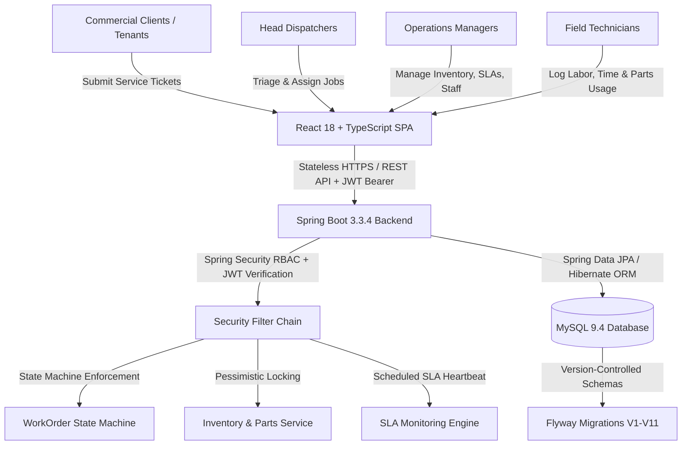
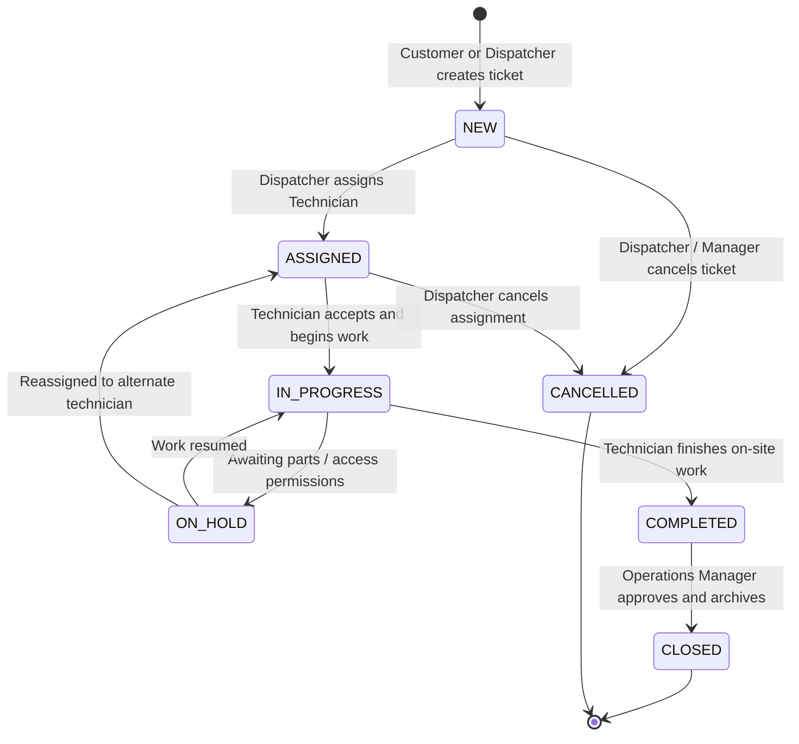

# PROJECT KEYSTONE — Field Service Management Platform

> **Enterprise-grade Field Service Management (FSM) platform engineered for commercial facilities maintenance, HVAC, electrical, and plumbing operations.**

[](https://spring.io/projects/spring-boot)
[](https://openjdk.org/)
[](https://react.dev/)
[](https://www.typescriptlang.org/)
[](https://vitejs.dev/)
[](https://www.mysql.com/)
[](https://flywaydb.org/)
[](https://railway.app)
[](https://github.com/ashutosh7034/keystone-field-service-platform)

---

## 1. Live Production Deployment

| Service | Environment | Live URL | Status |
| :--- | :--- | :--- | :--- |
| **Frontend Web Application** | Production (Railway) | [https://frontend-production-7397.up.railway.app](https://frontend-production-7397.up.railway.app) | **Online** |
| **Backend REST API** | Production (Railway) | [https://backend-production-e385.up.railway.app](https://backend-production-e385.up.railway.app) | **Online** |
| **API Health Endpoint** | Production (Railway) | [https://backend-production-e385.up.railway.app/api/health](https://backend-production-e385.up.railway.app/api/health) | **HTTP 200 OK** |
| **OpenAPI / Swagger Documentation** | Production (Railway) | [https://backend-production-e385.up.railway.app/swagger-ui.html](https://backend-production-e385.up.railway.app/swagger-ui.html) | **Active** |

---

## 2. Project Overview

**PROJECT KEYSTONE** is an enterprise-scale, full-stack Field Service Management (FSM) platform designed to digitize, streamline, and govern end-to-end field service workflows for modern facility management companies, commercial property managers, and field service contractors.

The platform provides a centralized operational hub connecting Operations Directors, Dispatchers, Field Technicians, and Commercial Clients under a unified system.



---

## 3. Problem Statement & Objectives

### The Problem
Commercial facilities management teams traditionally rely on fragmented communication channels (phone calls, emails, unformatted spreadsheets) to coordinate maintenance emergencies. This creates:
1. **Unenforced Work Order Progression**: Technicians closing jobs prematurely without recorded parts or labor logs.
2. **Inventory Stockouts & Race Conditions**: Inaccurate warehouse stock counts caused by uncoordinated simultaneous part consumption.
3. **Missed SLA Penalties**: Inability to identify at-risk emergencies before contractual deadlines breach.
4. **Data Security & Tenant Leakage**: Commercial tenants accessing unauthorized facility maintenance histories or other clients' tickets.

### Objectives
- **Strict Deterministic Lifecycle**: Prevent invalid status skips via an immutable backend finite state machine.
- **Transactional Audit Trail**: Record every transition with actor timestamp and audit notes automatically.
- **Thread-Safe Inventory Management**: Enforce database-level pessimistic locking (`PESSIMISTIC_WRITE`) to ensure atomic stock deductions.
- **Automated SLA Engine**: Continuously evaluate response and resolution times with dynamic `ON_TRACK`, `AT_RISK`, and `BREACHED` flags.
- **Strict Role-Based Multi-Tenancy**: Isolate commercial customers strictly to their owned facilities and tickets.

---

## 4. User Roles & Seed Demo Credentials

The platform is pre-seeded with operational demo accounts across all system roles. (The password for all demo accounts is **`password123`**):

| Role | Email | Name & Title | Assigned Scope & Primary Responsibilities |
| :--- | :--- | :--- | :--- |
| **Manager** | `manager@keystone.demo` | Eleanor Vance *(Operations Director)* | Full administrative access, work order closure, SLA analytics, parts inventory pricing, and user management. |
| **Dispatcher** | `dispatcher@keystone.demo` | David Ross *(Head Dispatcher)* | Work order triage, emergency dispatching, technician scheduling, priority adjustment, and work order cancellation. |
| **Technician 1** | `technician1@keystone.demo` | Alex Rivera *(Lead HVAC Tech)* | Mobile technician job board, work order execution (`IN_PROGRESS`), real-time labor logging, and parts consumption. |
| **Technician 2** | `technician2@keystone.demo` | Sarah Chen *(Master Electrician)* | Field job execution, electrical maintenance, and attachment upload. |
| **Customer 1** | `customer1@keystone.demo` | David Miller *(Apex Facilities VP)* | Client portal for Apex Commercial Towers: submit maintenance tickets, view technician status updates. |
| **Customer 2** | `customer2@keystone.demo` | Elena Rostova *(Metro Mall Director)* | Client portal for Metro Retail Outlets: submit maintenance tickets and track site repairs. |

> **Quick Demo Profiles**: The web application's login screen includes a 1-click Quick Profile Selector to switch between all roles instantaneously.

---

## 5. Work Order Lifecycle State Machine

Work order status transitions are strictly validated in [WorkOrderLifecycleStateMachine.java](file:///backend/src/main/java/com/keystone/service/WorkOrderLifecycleStateMachine.java). Any attempt to bypass the defined transition paths is rejected by the backend with `409 Conflict`.



### Transition Authority Matrix

| From Status | Allowed Target Statuses | Authorized Roles | Automated Actions Triggered |
| :--- | :--- | :--- | :--- |
| `NEW` | `ASSIGNED`, `CANCELLED` | Dispatcher, Manager | Creates immutable audit record; assigns technician ID. |
| `ASSIGNED` | `IN_PROGRESS`, `CANCELLED` | Assigned Technician, Dispatcher, Manager | Starts SLA resolution timer; records start timestamp. |
| `IN_PROGRESS` | `ON_HOLD`, `COMPLETED` | Assigned Technician, Manager | Validates minimum time logs; sets `completed_at` timestamp. |
| `ON_HOLD` | `IN_PROGRESS`, `ASSIGNED` | Assigned Technician, Dispatcher, Manager | Updates audit notes with hold reason. |
| `COMPLETED` | `CLOSED` | Operations Manager | Verifies billing readiness; sets `closed_at` timestamp. |

---

## 6. Technology Stack & Architecture

### Frontend Architecture
- **Framework**: React 18.3 (Functional components + Hooks)
- **Language**: TypeScript 5.6 (Strict Type Safety)
- **Build Tool**: Vite 5.4 (Fast HMR & Optimized Bundler)
- **Icons & UI**: Lucide React Icons, Responsive Grid & Flexbox, Glassmorphism design tokens
- **HTTP Client**: Axios 1.7 with JWT Request/Response Interceptors
- **State Management**: React Context API (`AuthContext`, Theme Providers)

### Backend Architecture
- **Framework**: Spring Boot 3.3.4
- **Language**: Java 21 LTS
- **Security**: Spring Security 6.3 + Stateless JWT Filter (`io.jsonwebtoken:jjwt:0.12.6`, HMAC-SHA384)
- **Persistence**: Spring Data JPA + Hibernate ORM 6.5
- **Database Migrations**: Flyway 10 (11 Versioned Migrations `V1` to `V11`)
- **API Documentation**: SpringDoc OpenAPI 2.6 / Swagger UI
- **Build System**: Apache Maven 3.9 Wrapper (`mvnw`)

### Database & Cloud Hosting
- **Database Engine**: MySQL 9.4 (InnoDB, Foreign Key Constraints, B-Tree Indexes)
- **Cloud Infrastructure**: Railway Cloud Platform
  - Frontend: Nginx Alpine Multi-Stage Container
  - Backend: OpenJDK 21 Alpine Container
  - Database: Managed MySQL 9.4 Instance with Persistent Volume

---

## 7. Key System Modules & Features

### 1. Stateless JWT Authentication & Role-Based Access Control (RBAC)
- Token claims encode `userId`, `role`, `fullName`, and `customerId`.
- Global authentication entry point returns RFC 7807 compliant standardized JSON error structures on authentication failure (`401 Unauthorized` / `403 Forbidden`).
- Method-level security enabled via `@PreAuthorize("hasRole('MANAGER')")` and `@PreAuthorize("hasAnyRole('MANAGER', 'DISPATCHER')")`.

### 2. Pessimistic Inventory Locking
- When a technician logs parts usage against a work order, `PartRepository` acquires an exclusive database write lock (`@Lock(LockModeType.PESSIMISTIC_WRITE)`).
- Validates that `stock_quantity >= requested_quantity`, deducts warehouse inventory atomically, and creates a `part_usage` audit record in a single database transaction.

### 3. Automated Background SLA Monitoring
- `@Scheduled(fixedRateString = "${keystone.sla.check-rate-ms:60000}")` engine scans open work orders every 60 seconds.
- Calculates remaining time against priority deadlines:
  - **Emergency**: 4 Hours
  - **High**: 12 Hours
  - **Medium**: 24 Hours
  - **Low**: 48 Hours
- Dynamically shifts SLA status to `AT_RISK` when remaining window falls below warning threshold (2 hours), or `BREACHED` when exceeded, dispatching notifications automatically.

### 4. Customer Tenant Isolation
- Customer users are bound to a non-nullable `customer_id` in their user profile.
- All customer endpoints query strictly by authenticated tenant context:
  ```java
  workOrderRepository.findByCustomerId(currentUser.getCustomerId(), pageable);
  ```
- Any attempt by a customer to request work orders belonging to another tenant is blocked with `403 Forbidden`.

### 5. File Attachments & Media Handling
- Multi-part file upload support for field photos, invoices, and diagnostic sheets.
- Stored with UUID-hashed filenames, MIME validation, and size restrictions (up to 10MB).

---

## 8. Database Schema & Flyway Migrations

The database schema is version-controlled via 11 Flyway migration scripts located in `backend/src/main/resources/db/migration/`:

| Version | Migration Script | Description |
| :--- | :--- | :--- |
| **V1** | `V1__create_users.sql` | Users table with role enums, hashed passwords, contact info. |
| **V2** | `V2__create_customers.sql` | Commercial client organizations and billing addresses. |
| **V3** | `V3__create_sites.sql` | Facility sites linked to client organizations. |
| **V4** | `V4__create_parts.sql` | Warehouse inventory table with SKU, cost, stock, and lead time. |
| **V5** | `V5__create_work_orders.sql` | Core work order table with lifecycle states, SLA deadlines, priority. |
| **V6** | `V6__create_status_history.sql` | Immutable append-only work order transition audit log. |
| **V7** | `V7__create_part_usage.sql` | Part consumption log linked to work orders and warehouse parts. |
| **V8** | `V8__create_time_logs.sql` | Technician labor hours and timesheet entries. |
| **V9** | `V9__create_notifications.sql` | Real-time in-app notification queue. |
| **V10** | `V10__create_attachments.sql` | Metadata store for uploaded job photos and documents. |
| **V11** | `V11__seed_reference_data.sql` | Initial reference data, demo customers, parts, and seed work orders. |

---

## 9. REST API Overview

| Method | Endpoint | Authorized Roles | Description |
| :--- | :--- | :--- | :--- |
| `POST` | `/api/auth/login` | Public | Authenticates credentials and returns signed JWT token. |
| `GET` | `/api/auth/me` | Authenticated | Retrieves current user profile and session details. |
| `GET` | `/api/health` | Public | System health check and uptime status. |
| `GET` | `/api/work-orders` | Manager, Dispatcher | Paginated search and filtering of all work orders. |
| `POST` | `/api/work-orders` | Manager, Dispatcher | Creates a new operational work order. |
| `GET` | `/api/work-orders/{id}` | All Roles (Scoped) | Retrieves full work order details with audit history. |
| `POST` | `/api/work-orders/{id}/status` | All Roles (Scoped) | Executes a lifecycle status transition. |
| `POST` | `/api/work-orders/{id}/assign` | Manager, Dispatcher | Assigns a work order to a field technician. |
| `GET` | `/api/technician/work-orders` | Technician | Retrieves jobs assigned to the authenticated technician. |
| `POST` | `/api/work-orders/{id}/parts` | Technician, Manager | Logs part consumption with atomic stock deduction. |
| `POST` | `/api/work-orders/{id}/time` | Technician, Manager | Logs technician labor minutes and job notes. |
| `GET` | `/api/customer/work-orders` | Customer | Retrieves tickets belonging strictly to the customer tenant. |
| `POST` | `/api/work-orders/customer-request` | Customer | Submits a new client maintenance request. |
| `GET` | `/api/parts` | Manager, Dispatcher, Tech | Searches warehouse parts catalog and stock levels. |
| `GET` | `/api/dashboard/summary` | Manager, Dispatcher | Fetches aggregated KPIs, SLA metrics, and active orders. |

---

## 10. Local Development Setup

### Prerequisites
- **Java Development Kit (JDK)**: Version 21 LTS
- **Node.js**: Version 20.x or higher & `npm` 10.x
- **MySQL Server**: Version 8.0 or 9.x
- **Git**: Installed and configured

### Step 1: Clone the Repository
```bash
git clone https://github.com/ashutosh7034/keystone-field-service-platform.git
cd keystone-field-service-platform
```

### Step 2: Database Configuration
1. Start your local MySQL server.
2. Create the database:
   ```sql
   CREATE DATABASE keystone_db CHARACTER SET utf8mb4 COLLATE utf8mb4_unicode_ci;
   ```
3. (Optional) Create a local `.env` file in the project root based on `.env.example`.

### Step 3: Backend Setup
```bash
cd backend
# Run unit and integration tests
.\mvnw.cmd clean test   # On Windows
./mvnw clean test       # On Linux/macOS

# Start Spring Boot backend server (Port 8080)
.\mvnw.cmd spring-boot:run
```

### Step 4: Frontend Setup
```bash
cd ../frontend
# Install dependencies
npm install

# Start Vite development server (Port 5173)
npm run dev
```
Open [http://localhost:5173](http://localhost:5173) in your browser.

---

## 11. Environment Variables Configuration

| Variable | Default (Local) | Production Example | Description |
| :--- | :--- | :--- | :--- |
| `PORT` | `8080` | `8080` | Backend HTTP listening port. |
| `DB_URL` | `jdbc:mysql://localhost:3306/keystone_db?...` | `jdbc:mysql://mysql.railway.internal:3306/railway` | Database JDBC URL. |
| `DB_USERNAME` | `root` | *(Managed User)* | Database access username. |
| `DB_PASSWORD` | *(empty)* | *(Managed Password)* | Database access password. |
| `JWT_SECRET` | `404E6352...` | *(64+ Hex Character Key)* | HMAC-SHA secret key for token signing. |
| `JWT_EXPIRATION` | `86400000` (24 Hours) | `86400000` | JWT token lifespan in milliseconds. |
| `CORS_ALLOWED_ORIGINS` | `http://localhost:5173,http://localhost:3000` | `https://frontend-production-7397.up.railway.app` | Allowed CORS origins for browser security. |
| `VITE_API_URL` | `http://localhost:8080` | `https://backend-production-e385.up.railway.app` | Frontend base URL for backend API calls. |

---

## 12. Automated Verification & Test Results

The backend contains automated JUnit 5 and Mockito test suites covering business logic, state machines, concurrency, and security isolation:

```
[INFO] -------------------------------------------------------
[INFO]  T E S T S
[INFO] -------------------------------------------------------
[INFO] Running com.keystone.service.AuthServiceTest
[INFO] Tests run: 4, Failures: 0, Errors: 0, Skipped: 0 - in com.keystone.service.AuthServiceTest
[INFO] Running com.keystone.service.CustomerIsolationTest
[INFO] Tests run: 3, Failures: 0, Errors: 0, Skipped: 0 - in com.keystone.service.CustomerIsolationTest
[INFO] Running com.keystone.service.PartUsageTransactionTest
[INFO] Tests run: 2, Failures: 0, Errors: 0, Skipped: 0 - in com.keystone.service.PartUsageTransactionTest
[INFO] Running com.keystone.service.SlaServiceTest
[INFO] Tests run: 2, Failures: 0, Errors: 0, Skipped: 0 - in com.keystone.service.SlaServiceTest
[INFO] Running com.keystone.service.WorkOrderLifecycleTest
[INFO] Tests run: 8, Failures: 0, Errors: 0, Skipped: 0 - in com.keystone.service.WorkOrderLifecycleTest
[INFO]
[INFO] Results:
[INFO] Tests run: 19, Failures: 0, Errors: 0, Skipped: 0
[INFO] BUILD SUCCESS
```

---

## 13. Project Directory Structure

```text
keystone-field-service-platform/
├── .env.example
├── README.md
├── PROJECT_REPORT.md
├── docker-compose.yml
├── start-keystone.bat
├── start-keystone.ps1
├── test-e2e.ps1
│
├── backend/
│   ├── Dockerfile
│   ├── pom.xml
│   └── src/
│       ├── main/
│       │   ├── java/com/keystone/
│       │   │   ├── config/            # Web, CORS & Swagger configuration
│       │   │   ├── controller/        # REST API endpoint controllers
│       │   │   ├── dto/               # Request & response data transfer objects
│       │   │   ├── entity/            # JPA domain entities
│       │   │   ├── exception/         # Custom exceptions & global handler
│       │   │   ├── repository/        # Spring Data JPA repositories
│       │   │   ├── security/          # Spring Security, JWT filters & services
│       │   │   └── service/           # Business logic & state machine engines
│       │   └── resources/
│       │       ├── application.yml    # Application configuration
│       │       └── db/migration/      # Flyway SQL migrations (V1..V11)
│       └── test/java/com/keystone/    # JUnit 5 & Mockito test suites
│
└── frontend/
    ├── Dockerfile
    ├── nginx.conf                     # Production Nginx reverse proxy configuration
    ├── package.json
    ├── tsconfig.json
    ├── vite.config.ts
    └── src/
        ├── api/                       # Axios client & typed service endpoints
        ├── components/                # Reusable UI components & modals
        ├── context/                   # AuthContext & state providers
        ├── pages/                     # Application pages (Dashboard, Kanban, Portal)
        └── types/                     # TypeScript domain models & enums
```

---

## 14. Screenshots Section

| View | Description | Preview |
| :--- | :--- | :--- |
| **Operations Dashboard** | Real-time KPI summaries, active work orders, SLA compliance metrics. | `[SCREENSHOT PLACEHOLDER: Manager Operations Dashboard]` |
| **Kanban Board** | Visual drag-and-drop / column progression of active field work orders. | `[SCREENSHOT PLACEHOLDER: Kanban Board View]` |
| **Field Technician Portal** | Mobile-optimized job queue, time tracking, and part usage recording. | `[SCREENSHOT PLACEHOLDER: Technician Mobile Field Portal]` |
| **Client Service Portal** | Multi-tenant customer interface for submitting and tracking tickets. | `[SCREENSHOT PLACEHOLDER: Customer Service Portal]` |

---

## 15. Planned Enhancements (Future Scope)

- [ ] **Push Notifications via WebSockets**: Real-time broadcast of technician status changes to dispatchers.
- [ ] **GPS Geolocation & Routing**: Route optimization for multi-stop technician schedules.
- [ ] **Offline PWA Capabilities**: IndexedDB caching for technicians in network-dead commercial basements.
- [ ] **Multi-Factor Authentication (MFA)**: TOTP / SMS verification for administrative and manager accounts.

---

## 16. License

This project is licensed under the [MIT License](LICENSE).
